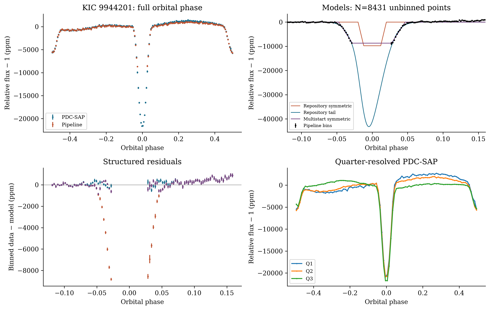
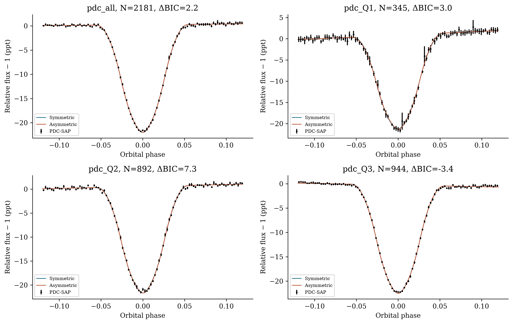
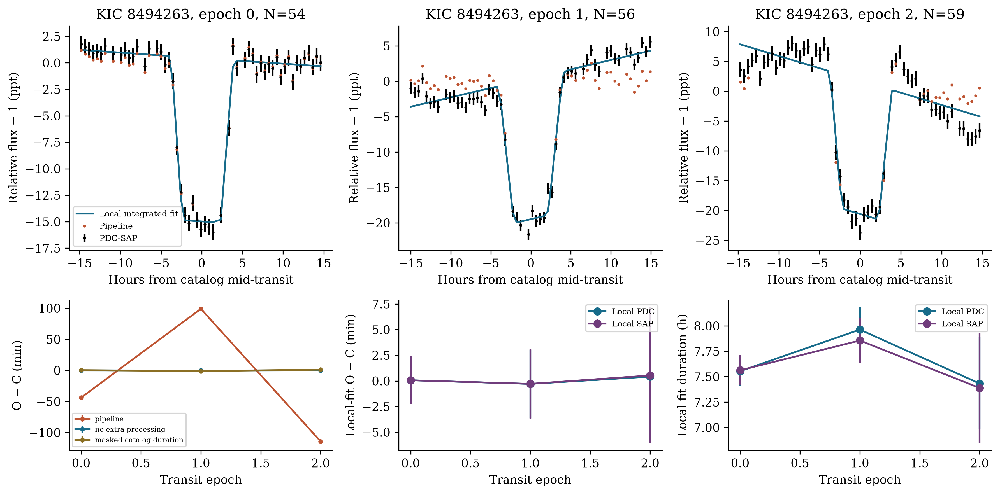
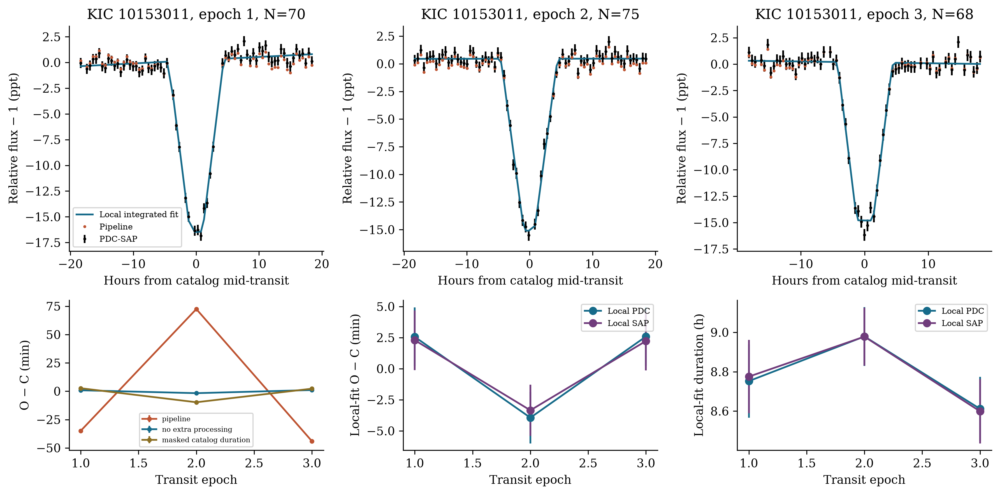
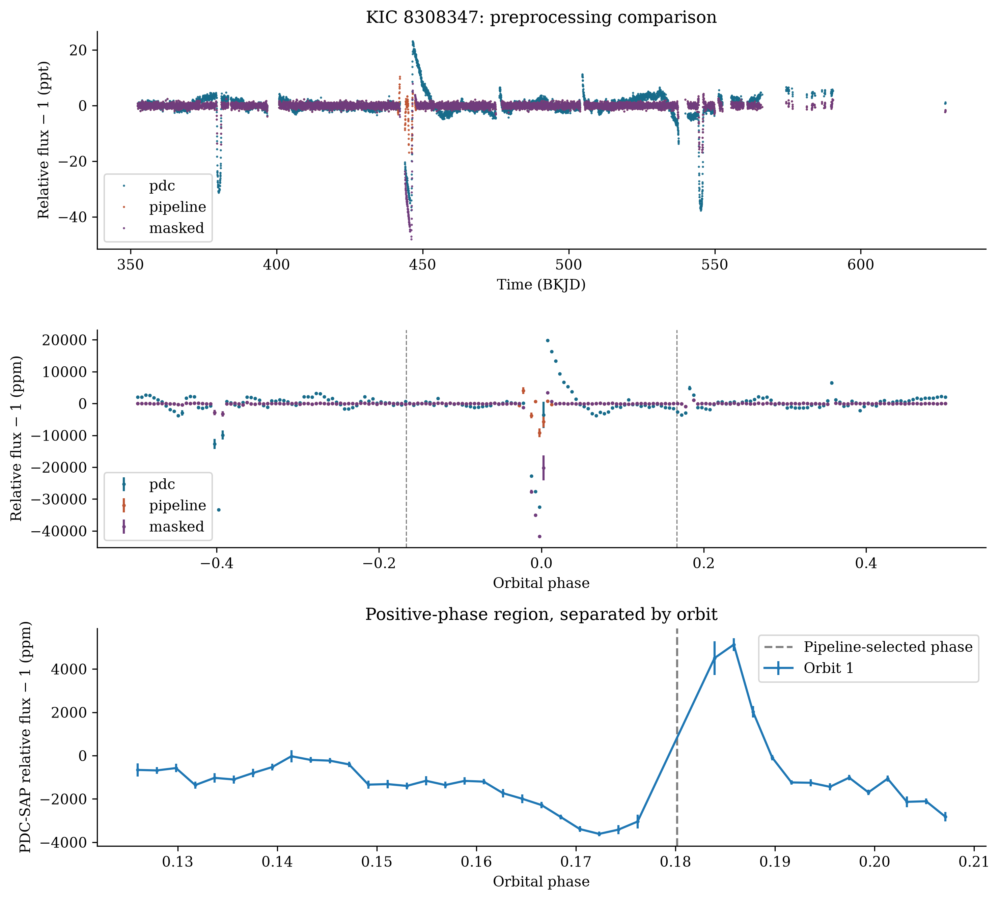
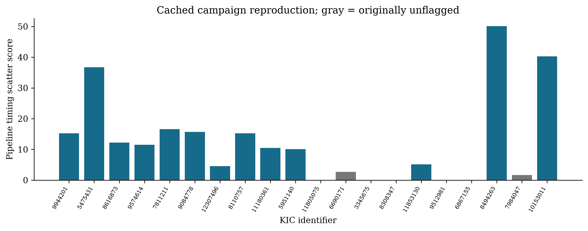

# Abstract

Archival transit searches can identify unusual astrophysical systems, but their interpretation depends on whether preprocessing preserves the events being measured. We independently reproduce a 20-target Kepler search and investigate four selected objects using the cached long-cadence observations, executable models, and an independent FITS reader. All twelve FITS products for these four objects match the current MAST files byte for byte. For KIC 9944201, the reported asymmetric-model preference of $\Delta\mathrm{BIC}=73{,}042.7$ is reproduced, but outlier rejection removes 522 of 753 cadences within the catalog transit duration. A multistart symmetric fit eliminates this preference; an independent, exposure-integrated primary-shape comparison on unclipped PDC-SAP data gives only $\Delta\mathrm{BIC}=2.2$. A secondary minimum with quarter-specific contrasts of approximately 4,900–5,200 ppm persists, making eclipsing or blended-binary interpretations important alternatives. KIC 8494263 and KIC 10153011 each contain three measurable transit events. Their pipeline timing-scatter scores of 50.11 and 40.28 are dominated by clipping and template choices. Independent local fits to KIC 8494263 give timing residuals below 0.5 min with 2.3–5.6 min formal uncertainties. KIC 10153011 retains a tentative several-minute deviation, with formal linear-ephemeris $\chi^2=5.99$ for one degree of freedom in PDC-SAP and 4.45 in SAP. Neither object supplies a measured satellite-specific timing–duration phase relationship. The positive-phase feature in KIC 8308347 samples only one orbital passage and shifts with preprocessing. These results establish a repeatable eclipse-like morphology and a tentative timing anomaly, while identifying reproducible selection artifacts that prevent the original dust-tail, exomoon, and Trojan scores from supporting those physical interpretations.

# 1. Introduction

The Kepler mission made long-baseline, precise stellar photometry available for both systematic planet searches and investigations of unusual occultations (Borucki et al. 2010). A transit search need not end with the identification of an approximately periodic dip. The shape of an event, its temporal evolution, and departures from a linear ephemeris can reveal additional information about the occulting system. Archival reanalysis is especially useful when the relevant signal is poorly represented by the templates used in an initial search.

Disintegrating-planet interpretations illustrate the value of transit morphology. The variable occultations of KIC 12557548 and the prolonged egress of KOI-2700 motivated models of dusty material surrounding or trailing a small body (Rappaport et al. 2012, 2014). Observations of K2-22 additionally demonstrated the relevance of changes in transit shape and wavelength-dependent extinction (Sanchis-Ojeda et al. 2015). These interpretations connect several observables. A preference for an asymmetric analytic function over one symmetric template is useful for selection, but it does not by itself identify the absorbing material or establish the nature of its source.

Timing provides a complementary route. A satellite can displace a transiting planet around the planet–satellite barycenter and alter its projected velocity, producing transit timing variations (TTVs) and transit duration variations (TDVs). Their relation can constrain a satellite model under specified orbital assumptions (Kipping 2009a,b). However, an empirical correlation angle is not generally an orbital phase measurement, particularly when only a few events are available. Published analyses of Kepler-1625 b and Kepler-1708 b illustrate the importance of photodynamical fitting, preprocessing, and independent verification (Teachey & Kipping 2018; Kipping et al. 2022). Competing reanalyses and responses also demonstrate why differences in an optimized fit should be resolved explicitly rather than treated as a verdict based on authority (Heller & Hippke 2023; Kipping et al. 2024).

Co-orbital searches pose a related problem: a decrement near a triangular Lagrange-point phase is a search statistic, whereas a Trojan interpretation requires an orbital association. Phase-domain searches have been applied to Kepler data, including population-based analyses (Hippke & Angerhausen 2015). For an individual object, limited phase coverage, correlated variability, and the number of trial apertures must be considered before interpreting a local minimum dynamically.

We investigate these issues in the FRONTIER ASTRONOMY AI Discovery Suite, designed, architected, and trained by Mustafa Shukr Hassan. Its Kepler campaign combines analytic morphology fitting, timing extraction, and a heuristic candidate score. The relevant inference path is conventional numerical analysis; it does not use a trained classifier to distinguish these four astrophysical systems. We first reproduce the saved campaign, then test the principal claims for KIC 9944201, KIC 8494263, KIC 10153011, and KIC 8308347. The aim is to determine which measurements survive, not to impose either a discovery or a rejection narrative. The resulting study concerns a bounded subset of the archive and makes no claim to a complete Kepler survey or to discovery priority.

# 2. Observations and target selection

## 2.1. Campaign definition

The selection script queries the NASA Exoplanet Archive cumulative KOI table for objects labeled `CANDIDATE` in two period intervals: $0.2<P<1.0$ d and $50<P<300$ d. Within each list, the campaign selects the ten largest catalog depths. These twenty objects therefore form a depth-selected sample, not an occurrence-rate sample. Their identities and original outputs are retained in `results/real_nasa_discoveries.json`. We reproduce their analyses from the locally cached FITS files without replacing that historical output.

The archive downloader selects at most three long-cadence files per object from its directory listing. The resulting time coverage is consequently a property of the cached selection, not the complete available mission coverage. Periods and reference epochs enter from the catalog; the search does not independently rediscover those orbital periods. Only the timing module subsequently refits a linear ephemeris to its measured transit times.

## 2.2. Data products and provenance

The observations reside in `data/cache/real_kepler/`. The priority-target FITS headers identify Kepler data release 25, barycentric reference time 2454833, and the TDB time system. We use BKJD to denote the tabulated barycentric time in days relative to that reference. The median long-cadence spacing is approximately 29.4 min. For each file, the provenance table records the quarter, cadence count, time range, SHA-256 digest, flux-crowding keywords, and archive path. Independently retrieved MAST bytes have the same SHA-256 digests as all twelve priority-target files. Astropy also independently reproduces the repository reader's retained times and normalized PDC-SAP fluxes to the stated numerical tolerance.

The repository reader selects `PDCSAP_FLUX` and `PDCSAP_FLUX_ERR`, accepts finite positive-flux cadences with `SAP_QUALITY=0`, and divides each file's flux and uncertainty by its median flux. Thus, the frequently used description “raw flux” in previous project material refers to already conditioned and normalized PDC-SAP photometry, not detector counts or uncorrected aperture photometry. Our SAP comparison instead reads `SAP_FLUX` and its uncertainty from the same FITS tables, retains the same PDC-defined quality sample, and normalizes it by quarter. The distinction follows the archived product definitions (MAST documentation). No target-pixel files are analyzed here.

Table 1 summarizes the four priority targets. Counts before project preprocessing already include the reader's quality selection. Counts after preprocessing additionally include the project's clipping. The baseline is the separation between the first and last accepted timestamps; it is not continuous exposure time.

| KIC | KOI | Catalog period (d) | Catalog duration (h) | Quarters | Accepted / processed cadences | Baseline (d) |
|:---|:---|---:|---:|:---|---:|---:|
| 9944201 | K07259.01 | 0.721522907 | 1.4521 | 1–3 | 8,958 / 8,431 | 217.984 |
| 8494263 | K01255.01 | 78.9257421 | 7.5193 | 4–6 | 10,695 / 10,111 | 276.899 |
| 10153011 | K01773.01 | 83.09708021 | 9.2639 | 2–4 | 11,352 / 11,286 | 272.438 |
| 8308347 | K03761.01 | 164.950399 | 30.8600 | 4–6 | 8,383 / 8,115 | 276.532 |

Table 1. Catalog ephemerides and the actual cached observational sample. Individual FITS filenames and quarter-level counts are supplied in `tables/fits_manifest.csv`.

An independent online query during this investigation returns `CANDIDATE` for both the archive and pipeline disposition fields of all four KOIs. The disposition scores are 0.705, 0.436, 0.000, and 0.000 in the order of Table 1. The last two scores do not change the accompanying categorical fields to `FALSE POSITIVE`. A disposition score is neither a satellite probability nor a substitute for the disposition itself (NASA Exoplanet Archive column documentation). The complete query and response are retained with retrieval timestamps.

# 3. Analysis methods

## 3.1. Reproduction and preprocessing experiments

The campaign applies strict quality selection, asymmetric outlier rejection, and iterative Savitzky–Golay smoothing before invoking both detectors. Outlier rejection compares flux with a running median of 101 samples and thresholds the residual using a global scaled median absolute deviation. The negative and positive thresholds are respectively six and 3.5 times that scale; a further rule removes some samples after positive excursions. The smoothing uses a one-day window, a quadratic polynomial, and up to three iterations of negative-residual masking and interpolation.

The preprocessing API can protect catalog transit windows, but the campaign calls it without period, epoch, or duration. It therefore omits the available prior protection in both clipping and the initial smoothing mask. The smoothing still attempts iterative dip masking: describing it as permanently and wholly unmasked would also be inaccurate. Moreover, smoothing operates on the concatenated sample sequence without explicitly segmenting observing gaps. Both details matter when diagnosing its effects.

We compare the original pipeline with quality-selected PDC-SAP alone, clipping alone, smoothing without clipping, and preprocessing supplied with the catalog ephemeris and duration. The latter protects points within $1.5D$ of nominal mid-transit, where $D$ is the catalog duration. To separate preprocessing from template mismatch, we repeat the repository timing measurement with its default duration and with the catalog duration. All seven timing configurations are retained; the analysis does not select only the configuration that gives the smallest residual.

## 3.2. Morphology models and statistical comparison

The repository's symmetric model is a trapezoid with fitted depth, total phase width, ingress fraction, and phase offset. Its alternative is a phenomenological sigmoid–exponential extinction function plus a Gaussian brightening term:

$$
F(\phi)=1-d\,\operatorname{expit}(u/\sigma)\exp[-(\max(0,u)/\lambda)^a]
 +A\exp[-(\phi+0.020)^2/(2\times0.008^2)],\qquad u=\phi+\phi_0.
$$

The six adjusted quantities are $d,\sigma,\lambda,a,\phi_0,A$. The Gaussian location and width are fixed. This expression is the actual executable template; its labels do not make it a full radiative-transfer calculation of a dust tail. The exponent $a$ is distinct from the subsequently reported morphology asymmetry $\alpha$.

For prescribed independent Gaussian errors, the code evaluates

$$
\chi^2=\sum_i[(f_i-m_i)/\sigma_i]^2,\qquad
\mathrm{BIC}=\chi^2+k\ln N,\qquad
\Delta\mathrm{BIC}=\mathrm{BIC}_{\rm sym}-\mathrm{BIC}_{\rm alt}.
$$

The common likelihood normalization cancels between models evaluated on the same sample and uncertainties. However, the repository uses $k=5$ and $k=8$ for models with four and six fitted parameters. We report the original statistic for reproduction and distinguish count-corrected comparisons. Both original fits use a single initial parameter vector, bounded least squares, and limited function evaluations; exceptions silently return the initial vector. We independently restart the symmetric fit from twelve width–offset combinations. The repository's likelihood-ratio probability is not used as an astrophysical significance: these template families are not established as regular nested hypotheses, and the error model does not include time-correlated residuals.

The reported $\alpha$ compares the interval before and after the fitted minimum at a threshold of ten percent of the model depth, within an asymmetric phase window. It is measured from the fitted alternative model, not directly from an independent ingress/egress measurement. If clipping removes the core of the event, this quantity can depend on an unconstrained model interpolation.

We additionally fit the unclipped PDC-SAP primary of KIC 9944201 over $|\phi|<0.12$. A symmetric trapezoid with a free local linear continuum has six parameters. A seventh parameter $s$ allows different temporal scales on the two sides by replacing $x=\phi-\phi_c$ with $x/(1-s)$ before the center and $x/(1+s)$ after it. Both models average 21 equally spaced evaluations across the median cadence interval and use multiple initial widths. This tests asymmetry within a separate common model family, with an identical sample and error prescription for both fits. Its skew $s$ is not the repository's $\alpha$. The fits are diagnostic approximations, not limb-darkened binary or dusty-occultation solutions. Finite-exposure averaging is necessary when an event is sampled sparsely in time (Kipping 2010).

## 3.3. Transit times and durations

For each nominal epoch, the repository extracts a window extending $1.5D$ on either side and requires at least three samples. Its default $D$ is four hours for these targets, despite the available catalog durations. It fits a fixed-depth, fixed-duration trapezoid on an 81-point timing grid. The timing search half-width is $\min[0.4P,\max(0.04\,{\rm d},0.75D)]$, not $0.4P$ unconditionally. A three-point parabola refines an interior minimum. Its curvature gives a formal uncertainty with a 0.1-min floor; boundary cases use a prescribed width-based uncertainty.

A weighted linear ephemeris $t_E=T_0+EP$ is fitted to those times. The saved “TTV SNR” is

$$
S_{\rm TTV}=\frac{\sqrt{2}\,\operatorname{std}(O-C)}{\langle\sigma_t\rangle},
$$

using the population standard deviation. It is a scatter-to-error score, not a calibrated detection significance in Gaussian standard deviations. With three transit times and two fitted ephemeris coefficients, only one timing-residual degree of freedom remains.

The TDV routine stretches the nominal duration over 41 factors from 0.6 to 1.4. It assigns each fitted duration an uncertainty equal to five percent of the nominal duration, rather than estimating it from the likelihood. For short series, the phase routine returns the arccosine of a normalized zero-lag correlation. For four or more entries, it may search harmonic periods on consecutive array indices rather than actual epoch spacings. A constant timing or duration series returns zero degrees as a sentinel with no measured phase. None of these operations provides the claimed phase uncertainty of a few degrees for KIC 8494263.

For an independent timing diagnostic, we fit individual PDC-SAP and SAP events within $2D$ of the catalog center. A trapezoid's center, depth, duration, and ingress fraction are fitted simultaneously with a linear continuum. The model averages fifteen evaluations across each cadence interval. Multiple initial centers are tried, and covariance is calculated from the local Jacobian, multiplied by $\max(1,\chi^2/\nu)$. Windows require at least twenty points and five continuum-side samples on each side. These uncertainties remain conditional on the shape and noise model; they do not account fully for red noise or preprocessing uncertainty. Fits and covariance ranks are saved for every event.

## 3.4. Candidate scoring and co-orbital search

The function named `compute_exomoon_posterior` transforms a manually constructed score into odds. With its default prior, the log-odds contribution is

$$
L=0.8(S_{\rm TTV}-3)-\frac{(\theta-90^\circ)^2}{2(15^\circ)^2}
-5I_{\rm edge}+0.5\max(0,S_{\rm shoulder}-2),
$$

where $I_{\rm edge}$ indicates an angle within $15^\circ$ of zero or $180^\circ$. The logistic result is clipped to $[0.001,0.999]$; nonpositive timing scores return 0.01 directly. The terms are not marginal likelihoods derived from fitted planet-only and planet–satellite models. We therefore call the result a heuristic score. In particular, a constant TDV series can produce a missing-phase sentinel of zero while a sufficiently large timing score still drives the output to 0.999.

The Trojan routine examines 21 trial centers near each of $\phi=\pm1/6$. Its box half-width is the larger of 0.005 phase and half the nominal duration in phase. It divides the mean flux depression by a baseline MAD divided by the square root of the number of samples. For KIC 8308347 the box's full width is therefore about 1.65 d, despite the default four-hour duration. Neither within-box correlation nor the trial search is included in this nominal score. We retain its result, separate contributing orbital passages, and compare the selected aperture with local sidebands. We do not convert that nominal score into a false-alarm probability.

# 4. Results

## 4.1. KIC 9944201: recurrent eclipses and an optimization-dependent asymmetry score

The original campaign values are recovered exactly in the installed numerical environment: $N=8{,}431$, $\Delta\mathrm{BIC}=73{,}042.749$, and fitted $\alpha\simeq0.534$. The corresponding symmetric and alternative $\chi^2$ values are 259,970.368 and 186,900.500. Correcting only the parameter counts gives $\Delta\mathrm{BIC}=73{,}051.789$, so the counting error is not the principal cause of the preference.

The decisive issue is the retained sample. Clipping removes 522 of the 753 cadences inside the catalog transit duration. The processed sample contains no points within $|\phi|<0.02$, the initial symmetric model's support. The optimizer therefore starts where changes to that narrow template cannot improve the sampled residuals through the local derivative. Its returned duration, ingress fraction, and center remain at their initial values. The alternative spans a wider region, but its exponent approaches the upper bound of 2.5 and its brightening amplitude approaches the upper bound of 0.015. Its inferred core is interpolated across missing observations.

Restarting the symmetric fit with wider initial profiles reduces its $\chi^2$ to 186,875.480, slightly below the original alternative. With four versus six parameters, the preference becomes approximately $\Delta\mathrm{BIC}=-43.1$. Thus, the original large positive value does not survive even this change within the original symmetric family. Neither full-phase template includes the secondary minimum or the varying orbital baseline, and both leave substantial structured residuals.

The unclipped primary provides a more direct morphological test. For 2,181 PDC-SAP samples within $|\phi|<0.12$, the exposure-integrated skew extension gives $\Delta\mathrm{BIC}=2.16$ and $s=-0.0164$ with a scaled local covariance error of 0.0152. Quarter-specific comparisons give 2.96, 7.29, and −3.44. The reduced $\chi^2$ of the combined fit is approximately 9.28, so these are descriptive model comparisons under an inadequate white-noise prescription. They do not establish a strong, persistent trailing asymmetry. The corresponding globally normalized SAP fits have much larger residuals and are not suitable for a physical asymmetry inference without improved baseline treatment.

Figure 1. KIC 9944201. Upper left: full-phase PDC-SAP and campaign-processed flux. Upper right: the original symmetric template, the original alternative, and the multistart symmetric fit; models are evaluated continuously through the missing core, whereas data bins require at least two observations. Lower left: residual bins, with gaps left unconnected. Lower right: PDC-SAP profiles by quarter. Flux-bin error bars use the larger of the propagated independent-error estimate and the empirical standard error. These bars do not include covariance between cadences. Fits use unbinned data.

Figure 2. Independent exposure-integrated symmetric and skewed trapezoids fitted to unclipped PDC-SAP photometry, for all quarters together and for each quarter separately. The free linear continuum is included in both models. Positive $\Delta\mathrm{BIC}$ favors the skew extension under the adopted error model. The plotted curves are nearly coincident, and the direction and strength of the formal preference do not support the original large trailing-asymmetry claim. Here ppt denotes parts per thousand.

The full phase curve nevertheless contains a robust secondary minimum near half an orbital cycle. We measure a descriptive eclipse contrast using the mean flux within 0.02 phase of each center and local sidebands at distances 0.09–0.14. Means of the per-orbit secondary contrasts are $4{,}884\pm373$, $5{,}220\pm78$, and $4{,}857\pm74$ ppm in quarters 1–3, from 31, 85, and 66 accepted orbit groups. The quoted errors are standard errors of the orbit-to-orbit contrasts. They do not include correlated variability between orbits or systematic effects of the baseline definition. Primary contrasts in the same procedure are about 19,700–20,300 ppm. These aperture contrasts are not fitted eclipse depths and need not equal the catalog depth of 22,528 ppm.

The online catalog also reproduces the listed equilibrium temperature of 1475 K. It is a catalog model quantity, not a measured dust temperature or independent evidence for evaporation. The light curve warrants investigation as an eclipse-like system with orbital variability. An eclipsing binary, a diluted background binary, and a luminous companion are important competing hypotheses. The secondary minimum alone does not determine the companion mass, the source position, or whether a blend is present. A definitive binary classification and a mass-loss rate are not derived here.

## 4.2. KIC 8494263: transit loss dominates the reported timing signal

The cached quarters contain three events, at catalog epochs 0, 1, and 2. There are respectively 13, 14, and 14 quality-accepted samples inside the catalog duration. Project preprocessing retains only twelve of these 41 samples in total. The pipeline returns $S_{\rm TTV}=50.1065$, with residuals of −43.736, +99.015, and −114.130 min and formal timing errors of 2.041, 2.171, and 3.296 min.

Clipping alone gives 49.6700, whereas smoothing without clipping gives 13.0315. It is therefore incorrect to attribute the entire effect solely to the Savitzky–Golay filter. Both operations can matter, but removal of the transit information is the dominant contributor to the original extreme score. Transit-protected processing with the catalog-duration template gives 0.6929.

Applying the original four-hour template directly to normalized PDC-SAP gives 0.1868 and residuals of approximately +4.3, −9.6, and +11.2 s. This reproduces the earlier numerical audit, but it is not a physical upper limit on TTVs: the template is shorter than the actual event and the time uncertainties are much larger than these residuals. With the catalog duration but no additional processing, the same repository routine instead gives 6.6244. These two results demonstrate the sensitivity of fixed-template timing to baseline and shape assumptions.

Our independent local PDC-SAP fits give transit times 429.375688, 508.301052, and 587.227153 BKJD, with formal scaled errors of 2.254, 3.287, and 5.614 min. Their fitted linear-ephemeris residuals are +0.068, −0.287, and +0.419 min. SAP produces similarly small residuals with somewhat larger uncertainties. The fitted PDC-SAP durations are approximately 7.55, 7.96, and 7.43 h, and the depth and surrounding baseline vary between quarters. These observations do not support the original hour-scale timing excursions. They also do not establish that every smaller timing perturbation is absent.

The original TDV extraction returns the same four-hour duration for each processed event. Its phase output of zero is consequently an undefined-phase sentinel, not a measurement of in-phase behavior. We find no numerical analysis or saved output supporting the narrative value $91.4^\circ\pm3.2^\circ$. The heuristic 0.999 score can be reproduced, but does not supply evidence for an exomoon when the input timing measurement is unstable and no satellite-specific phase relation is measured.

Figure 3. KIC 8494263. Upper panels show each event in PDC-SAP, the local integrated fit, and the surviving campaign-processed points. The disappearance of most transit-bottom samples is visible directly. Lower left compares repository timing residuals under selected preprocessing choices; all seven configurations are provided in the numerical supplement. Lower middle shows independent local-fit O−C residuals from PDC-SAP and SAP. Lower right shows the independently fitted durations. Timing bars are individual midpoint errors, not errors of mutually independent O−C residuals; fitting the ephemeris correlates those residuals. Lines connect the three measurements only as a visual guide.

## 4.3. KIC 10153011: a tentative residual timing deviation

KIC 10153011 also contributes three usable events, at epochs 1–3 in quarters 2–4. The pipeline retains eleven of fifty samples inside the catalog durations and returns $S_{\rm TTV}=40.2815$. Its O−C residuals are −34.939, +72.494, and −44.070 min with formal errors of 1.774, 1.807, and 1.993 min. Clipping alone gives 39.9721; smoothing without clipping gives 2.2712. The four-hour template on PDC-SAP reproduces the earlier score of 2.1989, but catalog-duration configurations give scores near 5–6. Again, a single lower score is not sufficient to settle the astrophysical question.

Independent local PDC-SAP fits give 246.033845, 329.127114, and 412.229425 BKJD, with formal scaled midpoint errors of 2.358, 2.069, and 2.372 min. Their linear-ephemeris residuals are +2.558, −3.938, and +2.588 min. The resulting $\chi^2=5.99$ for one degree of freedom corresponds to a formal tail probability of 0.0144 under the conditional independent-error model. The SAP analysis gives +2.289, −3.345, and +2.228 min, $\chi^2=4.45$, and a formal probability of 0.0348. These probabilities do not include campaign selection, method trials, or a calibrated correlated-noise model.

The several-minute deviation in both flux products is worth retaining as a tentative timing anomaly. It is far smaller than the original pipeline signal and supplies only one independent residual degree of freedom. The duration measurements do not establish a periodic TTV–TDV relationship. We therefore do not identify a candidate satellite-induced signal on this evidence. Additional gravitational perturbations, transit-shape changes, and residual photometric systematics remain possible. Conversely, the present analysis does not justify declaring every timing variation refuted.

Figure 4. KIC 10153011, with the same measurement conventions as Figure 3. Local PDC-SAP and SAP fits both retain a small central-epoch timing deviation. Its size is comparable to a few formal midpoint errors and must be interpreted with the single residual degree of freedom and exploratory model choices in mind. The gross campaign excursions arise after clipping and fixed-template fitting.

## 4.4. KIC 8308347: a single-passage positive-phase feature

The cached baseline is 276.532 d, or approximately 1.68 catalog orbital periods. The original four-hour timing window returns no events. This result does not imply that the data contain no primary occultation: near epoch 1, forty accepted samples lie inside the 30.86-h catalog duration, but only two lie within the default timing window. A broader extraction returns one event whose duration reaches the template-stretch upper boundary. The next nominal primary epoch falls in a large gap. Thus “zero extracted transits” describes this particular default extractor, not the absence of observed occultation structure.

The campaign flags the positive-phase region with a nominal box score of 5.537 and a depth relative to unity of 1,117 ppm at $\phi=0.18017$. Without project preprocessing, the search selects $\phi=0.17117$, a depth of 3,140 ppm, and a nominal score of 13.72. Protecting the catalog primary leaves the original positive-phase feature essentially unchanged, since the protection does not cover that region. This is not an independent robustness test of a possible co-orbital transit.

Only one orbital passage contributes to the selected positive-phase aperture. At the campaign-selected center, its processed aperture contains ten samples and has a local sideband contrast of 1,097 ppm. The same aperture on PDC-SAP contains sixteen samples, lies only 33 ppm below the global normalization, and is about 1,609 ppm brighter than the selected local sidebands. The sign reversal and movement of the selected center demonstrate strong baseline and preprocessing dependence. The unprocessed phase interval contains a broad depression followed by brightening; the campaign statistic does not establish which component, if any, is an occultation.

A repeating Trojan-like event is therefore not demonstrated. Stellar or instrumental variability and an unrelated occulting source remain alternatives, but stellar rotation has not been identified as the cause by a rotation-period fit or an astrophysical model comparison. We describe this result as an unvalidated single-passage photometric feature, rather than either a dynamically established Trojan or a proven rotational false positive.

Figure 5. KIC 8308347. Top: accepted PDC-SAP, campaign-processed, and primary-protected flux versus time. Middle: their phase curves, with the nominal $\pm1/6$ phases indicated. Bottom: the positive-phase PDC-SAP region; only one orbit contributes. The dashed line marks the center selected by the processed-data search. Statistical bin errors do not account for time correlation. The full phase curve and time series contain additional structure that a local box statistic does not model.

# 5. Validation and control analysis

The complete cached 20-object campaign reproduces the saved $\Delta\mathrm{BIC}$ and timing-score values exactly in the recorded environment. This agreement establishes the computational origin of those outputs, not their physical calibration. Five campaign objects retain the original unflagged verdict: KIC 11805075, 6690171, 3345675, 9512981, and 7984047. In the narrow operational sense, 0/5 of these objects trigger the campaign anomaly verdict on rerunning the same pipeline. They were identified as controls from their null outputs, however, and are not an independently selected, astrophysically verified negative-control sample. The result cannot estimate population specificity.

Figure 6. Timing-scatter scores from all twenty reproduced campaign objects. Gray bars identify the five objects with the original unflagged verdict. The displayed values are algorithmic scores, not calibrated significances or probabilities. No measurement uncertainty is assigned to this deterministic output. Their sample definition is unsuitable for estimating a false-positive rate.

The repository test suite passes 201 tests with eight runtime warnings. Its validation scope requires inspection of the fixtures. The local benchmark Parquet files labeled KIC 12557548 and Kepler-1625b explicitly contain `is_synthetic: true` in their metadata. The suite also contains synthetic dust-tail injection/recovery and noise-control experiments. Those are real software experiments, but they do not constitute injection/recovery through the clipping, coverage, and contamination conditions of these four observed targets. No such target-specific calibration is performed here. The separate atmospheric-inversion branch does not participate in these Kepler classifications; its spectral outputs are not used as evidence in this paper.

Independent checks improve the evidential chain in several ways. FITS values are cross-read, public-file provenance is verified, clipping loss is counted, preprocessing operations are separated, alternative template durations are retained, and local SAP/PDC-SAP fits allow continuum terms. These checks isolate reproducible measurement failures without requiring every astrophysical alternative to be fitted. They do not replace a full light-curve likelihood with correlated noise, centroid vetting, or mission-wide timing analysis.

# 6. Discussion

The strongest recurrent photometric structure in this four-object sample is the primary–secondary pattern of KIC 9944201. The secondary contrast persists by quarter and is not created by the project's smoothing. Its presence makes the system scientifically informative even though the original dust-tail statistic fails. The changing out-of-eclipse waveform can arise from several effects, including stellar variability, irradiation, and tidal distortion. A descriptive two-harmonic fit away from both minima gives second-harmonic semiamplitudes of approximately 386–595 ppm across the three quarters. These coefficients are not a measurement of an ellipsoidal component: the waveform changes, other harmonics contribute, and no binary light-curve model has been fitted. In particular, we do not adopt the earlier report's precise ellipsoidal amplitude.

The morphology comparison also clarifies the distinction between a model preference and physical evidence. A very large BIC difference can emerge because one optimizer begins with a template narrower than the gap created by clipping. Counting parameters correctly does not repair a fit that has no local sensitivity to the event. A multistart fit tests this explanation directly, and the unclipped primary then permits an independent shape comparison. The remaining small skew preference is neither compelling nor persistent enough to support the original trailing-tail interpretation. This conclusion concerns these data and models; it does not assume that every asymmetry in a short-period system must be stellar.

The timing results provide a second caution with a different practical consequence. At KIC 8494263, restoring the event and fitting a local baseline produces measurements compatible with a linear ephemeris, while the original excursion exceeds an hour. The dominant lost information is inside the transit itself. At KIC 10153011, removing that failure leaves a smaller deviation visible in both SAP and PDC-SAP. Treating both objects as identically “refuted” would discard this distinction. The surviving deviation is a sensible target for improved analysis, but three epochs cannot identify a periodic timing waveform, determine an alias, or establish the orbital geometry of a satellite.

The phase statistic is especially vulnerable to overinterpretation. When TDV is constant because the duration fit returns the same grid value, zero is a failure sentinel. When a short series does vary, the arccosine of its sample correlation has no general equivalence to a physical phase lag. A credible satellite test must propagate timing–duration covariance, account for the actual epoch spacings, and compare self-consistent models. Theoretical quadrature expectations motivate such a test; they do not calibrate an arbitrary empirical score.

For KIC 8308347, the constraint is observational as well as statistical. The selected region is represented once. Its many cadences do not supply many independent orbital repetitions. Changing a baseline can select a different portion of a broad feature and produce a high nominal score when adjacent points are correlated. A coherent co-orbital interpretation therefore remains untested, and a specific stellar explanation remains unproven. The appropriate inference is that the campaign has selected structure requiring further characterization.

These outcomes favor a search workflow in which candidate ranking is followed by transit-preservation checks, model-optimization diagnostics, and target-specific validation. A useful anomaly catalog can contain interesting objects without attaching calibrated discovery probabilities. The scientific opportunity lies in recovering reliable observables from those objects and then testing the physical alternatives that those observables actually motivate.

# 7. Follow-up priorities

The highest immediate return is likely to come from extending the archived analysis before seeking new telescope time. All available quarters should be assembled with per-segment normalization, transit-preserving baselines, and explicit event-quality checks. For KIC 10153011, additional events can determine whether the several-minute residual repeats coherently, drifts secularly, or disappears under a better light-curve model. Injection and recovery of constant-ephemeris events into the actual local noise would calibrate the observed timing scatter. The same procedure would test the attainable limits for KIC 8494263 without interpreting small fitted residuals as upper bounds.

For KIC 9944201, full-orbit binary and planetary-occultation models should include finite exposure integration, a variable baseline, and dilution. Target-pixel difference images, centroid shifts, and Gaia-informed contamination checks would establish whether the primary and secondary originate at the same position. Spectroscopy and radial velocities could distinguish stellar from planetary companion masses if the target brightness and attainable precision permit. Multiband eclipse photometry would help test a dusty-extinction interpretation only after the periodic source and baseline are understood.

For KIC 8308347, the priority is additional archival passages through both the primary and the proposed positive-phase region, followed by a search with a correlated-noise model and a trial-corrected false-alarm assessment. New observations should be proposed only after a coherent ephemeris and realistic expected signal are established. None of these suggested observations is claimed to have been obtained in this study.

# 8. Conclusions

The FRONTIER ASTRONOMY campaign's principal numerical outputs are reproducible, but their physical labels exceed what the tested measurements establish. KIC 9944201 shows a robust recurrent secondary minimum and deserves characterization as an eclipse-like system. Its reported strong dust-tail preference is lost when optimization and transit preservation are examined. KIC 8494263's extreme timing score is not supported by independent local fits to its three cached events, and the claimed TTV–TDV quadrature measurement has no traceable numerical basis. KIC 10153011 retains a tentative several-minute timing anomaly that warrants additional epochs and noise calibration, without identifying a satellite. KIC 8308347 contributes a baseline-sensitive feature from a single orbital passage, insufficient for a coherent Trojan interpretation.

These are distinct outcomes. They support an observational and methodological reanalysis, rather than a confirmation paper or a blanket rejection of the underlying systems. The reproducible failure modes—removal of transit samples, inadequate starting templates, missing-phase sentinels, and uncalibrated score transformations—also define concrete improvements for future archival searches.

# Data and code availability

The public observations are Kepler long-cadence light-curve products held at MAST. Individual source URLs and checksums are provided in `sources/mast_verification.json` and `tables/fits_manifest.csv`. Catalog query parameters, responses, and retrieval timestamps are included in `sources/`. The open-source code, neural architectures, and executable analysis pipelines developed by Mustafa Shukr Hassan are publicly available on GitHub at [https://github.com/mustafashukrhassan/frontier-astronomy-ai](https://github.com/mustafashukrhassan/frontier-astronomy-ai).

The accompanying `analysis/reproduce.py`, `analysis/robustness.py`, and `analysis/supplement.py` regenerate the measurements, machine-readable tables, and figures from the cached observations. `REPRODUCIBILITY.md` records the exact commands and environment. `EVIDENCE_LEDGER.md` connects the principal manuscript statements to executable functions and numerical outputs. Original campaign outputs are preserved. These materials should accompany any eventual public release; authorship, affiliations, licensing, and repository deposition require the project owner's finalization.

# Appendix A. Individual local transit measurements

| KIC | Epoch | PDC-SAP midpoint (BKJD) | Midpoint error (min) | O−C (min) | Duration (h) | Duration error (min) |
|:---|---:|---:|---:|---:|---:|---:|
| 8494263 | 0 | 429.375688 | 2.254 | +0.068 | 7.554 | 8.586 |
| 8494263 | 1 | 508.301052 | 3.287 | −0.287 | 7.963 | 13.064 |
| 8494263 | 2 | 587.227153 | 5.614 | +0.419 | 7.433 | 27.175 |
| 10153011 | 1 | 246.033845 | 2.358 | +2.558 | 8.752 | 11.185 |
| 10153011 | 2 | 329.127114 | 2.069 | −3.938 | 8.979 | 8.980 |
| 10153011 | 3 | 412.229425 | 2.372 | +2.588 | 8.612 | 9.769 |

Table A1. Local exposure-integrated fits. Errors are scaled Jacobian covariance estimates conditional on the fitted trapezoid and linear continuum. Extra decimal places identify the saved fit and do not imply that absolute times are known to that precision. The corresponding SAP table, depths, sample counts, fit residual statistics, and boundary checks are distributed as CSV files.

# Appendix B. Preprocessing sensitivity of the repository timing score

| Photometry / extraction configuration | KIC 8494263 | KIC 10153011 |
|:---|---:|---:|
| Original campaign | 50.1065 | 40.2815 |
| PDC-SAP; default four-hour template | 0.1868 | 2.1989 |
| PDC-SAP; smoothing without clipping | 13.0315 | 2.2712 |
| PDC-SAP; clipping without smoothing | 49.6700 | 39.9721 |
| Protected preprocessing; four-hour template | 10.7089 | 2.2932 |
| Protected preprocessing; catalog-duration template | 0.6929 | 5.6677 |
| PDC-SAP; catalog-duration template | 6.6244 | 5.3481 |

Table B1. All seven repository-extraction configurations. Entries are dimensionless scatter scores, not Gaussian detection significances. “Protected” means that the period, epoch, and catalog duration were supplied to preprocessing. These results must not be compared as though the only change were a noise realization.

# References

Borucki, W. J., et al. 2010, “Kepler Planet-Detection Mission: Introduction and First Results,” *Science*, 327, 977–980. [NASA record](https://ntrs.nasa.gov/citations/20100030619); [doi:10.1126/science.1185402](https://doi.org/10.1126/science.1185402).

Rappaport, S., et al. 2012, “Possible Disintegrating Short-Period Super-Mercury Orbiting KIC 12557548,” *ApJ*, 752, 1. [doi:10.1088/0004-637X/752/1/1](https://doi.org/10.1088/0004-637X/752/1/1).

Rappaport, S., et al. 2014, “KOI-2700b—A Planet Candidate With Dusty Effluents on a 22 hr Orbit,” *ApJ*, 784, 40. [Original preprint](https://arxiv.org/abs/1312.2054); [doi:10.1088/0004-637X/784/1/40](https://doi.org/10.1088/0004-637X/784/1/40).

Sanchis-Ojeda, R., et al. 2015, “The K2-ESPRINT Project. I. Discovery of the Disintegrating Rocky Planet K2-22b with a Cometary Head and Leading Tail.” [Original paper, arXiv:1504.04379](https://arxiv.org/abs/1504.04379).

Kipping, D. M. 2009a, “Transit timing effects due to an exomoon,” *MNRAS*, 392, 181–189. [doi:10.1111/j.1365-2966.2008.13999.x](https://doi.org/10.1111/j.1365-2966.2008.13999.x).

Kipping, D. M. 2009b, “Transit timing effects due to an exomoon—II.” [Original paper, arXiv:0904.2565](https://arxiv.org/abs/0904.2565); [doi:10.1111/j.1365-2966.2009.14869.x](https://doi.org/10.1111/j.1365-2966.2009.14869.x).

Kipping, D. M. 2010, “Binning is sinning: morphological light-curve distortions due to finite integration time,” *MNRAS*, 408, 1758–1769. [Original paper, arXiv:1004.3741](https://arxiv.org/abs/1004.3741).

Teachey, A., & Kipping, D. M. 2018, “Evidence for a Large Exomoon Orbiting Kepler-1625b.” [Original paper, arXiv:1810.02362](https://arxiv.org/abs/1810.02362).

Kipping, D., et al. 2022, “An exomoon survey of 70 cool giant exoplanets and the new candidate Kepler-1708 b-i,” *Nature Astronomy*, 6, 367–380. [doi:10.1038/s41550-021-01539-1](https://doi.org/10.1038/s41550-021-01539-1).

Heller, R., & Hippke, M. 2023, “Large exomoons unlikely around Kepler-1625 b and Kepler-1708 b,” *Nature Astronomy*, published online in 2023. [doi:10.1038/s41550-023-02148-w](https://doi.org/10.1038/s41550-023-02148-w).

Kipping, D., et al. 2024, “A Reply to: Large Exomoons unlikely around Kepler-1625 b and Kepler-1708 b,” preprint. [arXiv:2401.10333](https://arxiv.org/abs/2401.10333).

Hippke, M., & Angerhausen, D. 2015, “A statistical search for a population of Exo-Trojans in the Kepler dataset,” *ApJ*, 811, 1. [Original paper](https://arxiv.org/abs/1508.00427); [doi:10.1088/0004-637X/811/1/1](https://doi.org/10.1088/0004-637X/811/1/1).

MAST, Kepler mission documentation and light-curve product guide. [Kepler data-processing pipeline](https://keplergo.github.io/KeplerScienceWebsite/pipeline.html); [Using Kepler Light Curve Products with Lightkurve](https://spacetelescope.github.io/mast_notebooks/notebooks/Kepler/lightkurve_analyzing_lc_products/lightkurve_analyzing_lc_products.html).

NASA Exoplanet Archive, “Data columns in Kepler Objects of Interest Table.” [Official column definitions](https://exoplanetarchive.ipac.caltech.edu/docs/API_kepcandidate_columns.html). The target-specific TAP response and retrieval time are supplied with this paper.
